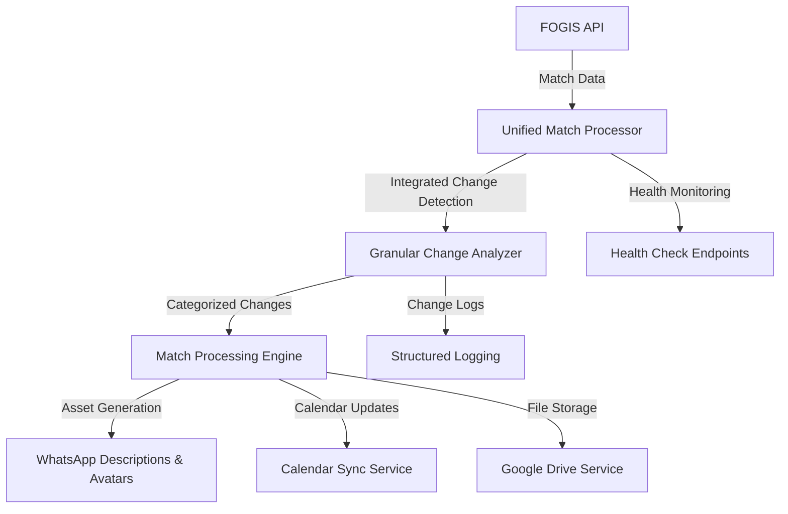

# FOGIS Match List Processor

**A unified service for comprehensive football match processing with integrated change detection and enhanced categorization.**

*Updated: 2025-09-01 - Issue #25: Configuration and Deployment Updates*

## 🎯 Overview

The FOGIS Match List Processor is a consolidated service that monitors FOGIS match data for changes and provides comprehensive processing capabilities. The service integrates change detection, match processing, and asset generation into a single, efficient application.

### 🏗️ Unified Service Architecture



### ✨ Key Features

- **🔍 Granular Change Detection**: Identifies specific types of changes (referee assignments, time changes, venue changes, etc.)
- **⚡ Enhanced Change Categorization**: 11 change categories with priority assessment and stakeholder impact analysis
- **🎨 Asset Generation**: WhatsApp group descriptions and team avatars
- **📅 Calendar Integration**: Automatic calendar sync for referee assignments
- **☁️ Cloud Storage**: Google Drive integration for asset management
- **🏥 Health Monitoring**: Comprehensive health checks and monitoring endpoints
- **⚙️ Unified Configuration**: Single service configuration and management
- **🚀 Production Ready**: Docker-based deployment with comprehensive validation

## 🚀 Quick Start

### Prerequisites

- **Docker Engine 20.10+** and **Docker Compose 2.0+**
- **Python 3.11+** (for development)
- **Git** for version control
- **Network access** to FOGIS API and external services

### 🐳 Production Deployment

```bash
# 1. Clone the repository
git clone https://github.com/PitchConnect/match-list-processor.git
cd match-list-processor

# 2. Configure environment
cp .env.example .env
# Edit .env with your specific configuration

# 3. Validate deployment configuration
./scripts/validate_deployment.sh

# 4. Start the unified service
docker compose up -d

# 5. Verify service health
curl http://localhost:8000/health/simple
```

### 🛠️ Development Setup

```bash
# Clone and setup development environment
git clone https://github.com/PitchConnect/match-list-processor.git
cd match-list-processor

# Create virtual environment
python -m venv .venv
source .venv/bin/activate  # On Windows: .venv\Scripts\activate

# Install dependencies
pip install -r requirements.txt
pip install -r requirements-dev.txt

# Install pre-commit hooks
pre-commit install

# Run comprehensive test suite
python -m pytest tests/ --cov=src --cov-report=html

# Validate code quality
pre-commit run --all-files
```

### 🐳 Docker Infrastructure

```bash
# Create required Docker volumes (if not exists)
docker volume create process-matches-data
docker volume create google-drive-service-data

# Create Docker network (if not exists)
docker network create fogis-network

# Start with development watch mode
./run.sh

# Or start in production mode
docker compose up -d
```

## 🏗️ Architecture

### Consolidated Service Design

The service follows a **unified architecture** with integrated change detection and processing:

```
┌─────────────────────────────────────────────────────────────┐
│                 Unified Match Processor                     │
├─────────────────────────────────────────────────────────────┤
│  ┌─────────────────┐  ┌─────────────────┐  ┌─────────────┐  │
│  │ Change Detection│  │ Match Processing│  │Asset Generation│ │
│  │                 │  │                 │  │             │  │
│  │ • Granular      │  │ • Unified Cycle │  │ • WhatsApp  │  │
│  │ • Categorized   │  │ • State Mgmt    │  │ • Avatars   │  │
│  │ • Prioritized   │  │ • Error Handle  │  │ • Uploads   │  │
│  └─────────────────┘  └─────────────────┘  └─────────────┘  │
└─────────────────────────────────────────────────────────────┘
                              │
                              ▼
┌─────────────────────────────────────────────────────────────┐
│                External Service Integration                 │
├─────────────────────────────────────────────────────────────┤
│  FOGIS API  │  Calendar Sync  │  Google Drive  │  WhatsApp  │
│   Client    │     Service     │    Service     │  Avatars   │
└─────────────────────────────────────────────────────────────┘
```

### 🔧 Core Components

- **🎯 Unified Processor**: Central processing engine with integrated change detection
- **🔍 Granular Change Detector**: Enhanced change categorization with 11 change types
- **📊 Change Categorization**: Priority assessment and stakeholder impact analysis
- **🎨 Asset Generator**: WhatsApp descriptions and team avatar creation
- **☁️ Service Integrations**: FOGIS API, Calendar Sync, Google Drive, Avatar services
- **🏥 Health Monitoring**: Comprehensive health checks and metrics

## 🔍 Enhanced Change Detection

### Granular Change Categorization

The service provides sophisticated change detection with **11 distinct change categories**:

| Category | Description | Priority | Stakeholders |
|----------|-------------|----------|--------------|
| `NEW_ASSIGNMENT` | New referee assignments | HIGH | Referees, Coordinators |
| `REFEREE_CHANGE` | Changes to existing assignments | HIGH | Referees, Coordinators |
| `TIME_CHANGE` | Match time modifications | HIGH | All |
| `DATE_CHANGE` | Match date modifications | HIGH | All |
| `VENUE_CHANGE` | Venue/location changes | MEDIUM | All |
| `TEAM_CHANGE` | Team information changes | MEDIUM | Teams, Coordinators |
| `CANCELLATION` | Match cancellations | CRITICAL | All |
| `POSTPONEMENT` | Match postponements | MEDIUM | All |
| `INTERRUPTION` | Match interruptions | MEDIUM | All |
| `STATUS_CHANGE` | General status modifications | MEDIUM | All |
| `COMPETITION_CHANGE` | Competition-level changes | LOW | Coordinators |

### Priority Assessment

- **🔴 CRITICAL**: Same-day changes, cancellations
- **🟠 HIGH**: Referee changes, time/date changes
- **🟡 MEDIUM**: Venue changes, team changes, postponements
- **🟢 LOW**: Competition changes, minor updates

### Stakeholder Impact Analysis

Changes are automatically analyzed for stakeholder impact:
- **👨‍⚽ Referees**: Assignment-related changes
- **👥 Coordinators**: Administrative and scheduling changes
- **🏃‍♂️ Teams**: Team and venue-related changes
- **🌐 All**: Critical changes affecting everyone

## ⚙️ Configuration

### Environment Variables

#### Core Processor Settings
```bash
# Unified processor configuration
PROCESSOR_MODE=unified              # Always 'unified' after Phase 1B
RUN_MODE=service                   # 'service' or 'oneshot'

# Enhanced change categorization
ENABLE_CHANGE_CATEGORIZATION=true  # Enable granular change detection
CHANGE_PRIORITY_SAME_DAY=critical  # Priority for same-day changes
ENABLE_CHANGE_LOGGING=true         # Detailed change logging
```

#### External Service URLs
```bash
# Required external services
FOGIS_API_CLIENT_URL=http://fogis-api-client-service:8080
WHATSAPP_AVATAR_SERVICE_URL=http://whatsapp-avatar-service:5002
GOOGLE_DRIVE_SERVICE_URL=http://google-drive-service:5000
PHONEBOOK_SYNC_SERVICE_URL=http://fogis-calendar-phonebook-sync:5003
```

#### Data Storage & Processing
```bash
# Data configuration
DATA_FOLDER=/data
PREVIOUS_MATCHES_FILE=previous_matches.json
MIN_REFEREES_FOR_WHATSAPP=2
TEMP_FILE_DIRECTORY=/tmp

# Google Drive settings
GDRIVE_FOLDER_BASE=WhatsApp_Group_Assets

# Logging configuration
LOG_LEVEL=INFO
LOG_FORMAT=%(asctime)s - %(levelname)s - %(message)s
```

## 🧪 Development Workflow

### Code Quality Tools

This project maintains high code quality with comprehensive tooling:

- **🎨 Black**: Automatic code formatting
- **🔍 flake8**: Linting and style checking
- **📦 isort**: Import sorting and organization
- **🔒 mypy**: Static type checking
- **🛡️ bandit**: Security vulnerability scanning
- **🧪 pytest**: Comprehensive testing framework

### Pre-commit Hooks

Automated quality checks run before each commit:

```bash
# Install pre-commit hooks
pre-commit install

# Run all hooks manually
pre-commit run --all-files

# Run specific quality checks
pre-commit run black      # Format code
pre-commit run flake8     # Lint code
pre-commit run mypy       # Type check
pre-commit run bandit     # Security scan
```

### Testing

#### Comprehensive Test Suite

```bash
# Run all 200+ tests
python -m pytest

# Run with coverage report
python -m pytest --cov=src --cov-report=html

# Run specific test categories
python -m pytest tests/test_change_categorization.py  # Change detection tests
python -m pytest tests/test_unified_processor.py      # Unified processor tests
python -m pytest tests/test_app.py                    # Application tests

# Run with verbose output
python -m pytest -v --timeout=30
```

#### Test Categories

- **🔍 Change Detection Tests**: Granular change categorization functionality
- **⚙️ Unified Processor Tests**: Core processing engine validation
- **🎨 Asset Generation Tests**: WhatsApp description and avatar creation
- **🏥 Health Check Tests**: Service monitoring and health endpoints
- **🔧 Integration Tests**: External service integration validation

### Type Checking

```bash
# Check all source code
python -m mypy src/

# Check specific modules
python -m mypy src/core/change_categorization.py
python -m mypy src/app_unified.py
```

## 🏥 Health Monitoring

### Health Check Endpoints

- **Simple Health**: `GET /health/simple` - Basic service status
- **Detailed Health**: `GET /health/detailed` - Comprehensive service information

### Service Monitoring

```bash
# Check service status
curl http://localhost:8000/health/simple

# Get detailed health information
curl http://localhost:8000/health/detailed

# Monitor logs in real-time
docker compose logs -f process-matches-service

# Check change categorization logs
docker compose logs process-matches-service | grep "ChangeCategory"
```

## 📊 API Documentation

### Core Endpoints

| Endpoint | Method | Description |
|----------|--------|-------------|
| `/health/simple` | GET | Basic health check |
| `/health/detailed` | GET | Detailed service status |
| `/process` | POST | Manual processing trigger |

### Change Detection API

The service provides rich change detection data through structured logging and can be extended with API endpoints for:

- **Change summaries** with categorization
- **Priority-based filtering** of changes
- **Stakeholder-specific** change notifications
- **Historical change analysis**

## 🚀 Deployment

### Production Deployment

```bash
# 1. Validate configuration
./scripts/validate_deployment.sh

# 2. Deploy with Docker Compose
docker compose up -d

# 3. Verify deployment
curl http://localhost:8000/health/detailed
```

### Deployment Validation

The service includes comprehensive deployment validation:

```bash
# Run deployment validation script
./scripts/validate_deployment.sh

# Expected output:
# ✅ Configuration files present and valid
# ✅ Docker configuration optimized for consolidated service
# ✅ Environment variables updated for Phase 1B
# ✅ No webhook dependencies found
# ✅ Enhanced change categorization configured
# ✅ All 200 tests pass with new configuration
```

For detailed deployment instructions, see [DEPLOYMENT_GUIDE.md](docs/DEPLOYMENT_GUIDE.md).

## 📈 Performance & Scaling

### Performance Characteristics

- **🚀 Fast startup**: Single unified service initialization
- **💾 Memory efficient**: Optimized for match list processing
- **🔄 Reliable processing**: Robust error handling and recovery
- **📊 Rich monitoring**: Comprehensive health checks and logging

### Scaling Considerations

- **Horizontal scaling**: Can be deployed in multiple instances if needed
- **Resource optimization**: Configurable memory and CPU limits
- **External dependencies**: Designed to handle external service failures gracefully

## 🔧 Troubleshooting

### Common Issues

#### Service Won't Start
```bash
# Check configuration
./scripts/validate_deployment.sh

# Check logs
docker compose logs process-matches-service

# Verify environment
grep PROCESSOR_MODE .env
```

#### Change Detection Issues
```bash
# Verify enhanced features
python -c "from src.core.change_categorization import GranularChangeDetector; print('OK')"

# Check categorization logs
docker compose logs process-matches-service | grep "MatchChangeDetail"
```

#### External Service Connectivity
```bash
# Test service connectivity
docker compose exec process-matches-service curl -f http://fogis-api-client-service:8080/hello
```

For comprehensive troubleshooting, see [DEPLOYMENT_GUIDE.md](docs/DEPLOYMENT_GUIDE.md).

## 📚 Contributing

### Development Guidelines

Please read [CONTRIBUTING.md](CONTRIBUTING.md) for detailed guidelines on:

- **Development workflow** and branch management
- **Code standards** and quality requirements
- **Testing requirements** (200+ tests, 95%+ coverage)
- **Pull request process** and review guidelines
- **Pre-commit hook setup** and quality checks

### Quality Standards

- **🎯 100% Test Success Rate**: All 200+ tests must pass
- **📊 High Code Coverage**: Maintain 95%+ test coverage
- **🔒 Security Compliance**: Pass bandit security scans
- **📝 Type Safety**: Full mypy type checking compliance
- **🎨 Code Formatting**: Automatic Black and isort formatting

### Development Workflow

1. **Fork and clone** the repository
2. **Create feature branch** from `main`
3. **Implement changes** with comprehensive tests
4. **Run quality checks** with `pre-commit run --all-files`
5. **Submit pull request** with detailed description
6. **Address review feedback** and ensure CI passes

## 🔄 CI/CD Pipeline

### Automated Quality Assurance

The project includes a comprehensive CI/CD pipeline:

- **🎨 Code Formatting**: Black, isort automatic formatting
- **🔍 Linting**: flake8 style and error checking
- **🔒 Type Checking**: mypy static type analysis
- **🛡️ Security Scanning**: bandit vulnerability detection
- **🧪 Comprehensive Testing**: pytest with 200+ tests
- **🐳 Docker Validation**: Container build and deployment verification
- **📊 Coverage Reporting**: Detailed test coverage analysis

### Quality Gates

All checks must pass before code can be merged:

- ✅ **All 200+ tests pass** (100% success rate)
- ✅ **Code coverage ≥ 95%** (comprehensive test coverage)
- ✅ **No security vulnerabilities** (bandit scan clean)
- ✅ **Type checking passes** (mypy validation)
- ✅ **Code style compliant** (Black, flake8, isort)
- ✅ **Docker build successful** (container validation)

## 🏥 Health Monitoring

### Health Check Endpoints

The unified service provides comprehensive health monitoring:

| Endpoint | Description | Use Case |
|----------|-------------|----------|
| `/health/simple` | Basic service status | Load balancer health checks |
| `/health/detailed` | Comprehensive service info | Detailed monitoring |
| `/` | Service information | API discovery |

### Health Check Features

- **🐳 Docker Integration**: Built-in `HEALTHCHECK` with curl monitoring
- **🔗 Dependency Monitoring**: Connectivity checks for external services
- **📊 Status Levels**: `healthy`, `degraded`, `unhealthy` classifications
- **⏱️ Response Time Tracking**: Performance monitoring
- **🛡️ Graceful Degradation**: Continues operation with partial failures

### External Service Dependencies

The service monitors connectivity to:
- **FOGIS API Client**: Match data source
- **WhatsApp Avatar Service**: Avatar generation
- **Google Drive Service**: Asset storage
- **Phonebook Sync Service**: Contact management

### Health Monitoring Commands

```bash
# Quick health check
curl http://localhost:8000/health/simple

# Detailed health information
curl http://localhost:8000/health/detailed

# Monitor service logs
docker compose logs -f process-matches-service

# Check change detection activity
docker compose logs process-matches-service | grep "ChangeCategory"
```

## 🐳 Container Images

### Official Releases

Container images are automatically built and published to GitHub Container Registry (GHCR):

```bash
# Pull the latest consolidated service release
docker pull ghcr.io/pitchconnect/match-list-processor:latest

# Pull a specific version
docker pull ghcr.io/pitchconnect/match-list-processor:v2.0.0

# Pull Phase 1B consolidated version
docker pull ghcr.io/pitchconnect/match-list-processor:phase-1b
```

### Available Tags

- **`latest`** - Latest stable consolidated service release
- **`vX.Y.Z`** - Specific version (e.g., `v2.0.0`)
- **`phase-1b`** - Phase 1B consolidated service with enhanced change detection
- **`unified`** - Unified processor architecture

### Multi-Architecture Support

Images support multiple architectures:
- **`linux/amd64`** (x86_64) - Standard server architecture
- **`linux/arm64`** (ARM64/AArch64) - ARM-based servers and Apple Silicon

### Image Features

- **🚀 Optimized Size**: Minimal base image with only required dependencies
- **🔒 Security Hardened**: Regular security updates and vulnerability scanning
- **📊 Health Checks**: Built-in health monitoring and validation
- **🔧 Configuration Ready**: Environment-based configuration support

## 📋 Release Management

### Version Strategy

- **Major versions** (v2.x.x): Architectural changes (Phase 1B = v2.0.0)
- **Minor versions** (vX.1.x): Feature additions and enhancements
- **Patch versions** (vX.X.1): Bug fixes and security updates

### Creating Releases

```bash
# Create and push version tag
git tag v2.0.0
git push origin v2.0.0

# Automated release process includes:
# - Multi-architecture container builds
# - GHCR image publishing
# - GitHub release creation
# - Security attestations
```

## 📖 Documentation

### Available Documentation

- **[DEPLOYMENT_GUIDE.md](docs/DEPLOYMENT_GUIDE.md)** - Comprehensive deployment instructions
- **[CONTRIBUTING.md](CONTRIBUTING.md)** - Development and contribution guidelines
- **[PHASE_1B_VERIFICATION.md](PHASE_1B_VERIFICATION.md)** - Phase 1B implementation verification
- **API Documentation** - Available through health endpoints

### Architecture Documentation

- **Unified Service Design** - Single consolidated service architecture
- **Enhanced Change Detection** - Granular categorization and priority assessment
- **External Service Integration** - FOGIS API, Calendar, Google Drive, WhatsApp
- **Health Monitoring** - Comprehensive service monitoring and validation

## 🎯 Project Status

### Phase 1B: Consolidated Service Architecture ✅

**Status: COMPLETED (2025-08-31)**

- ✅ **Webhook Dependencies Removed** - Simplified architecture
- ✅ **Enhanced Change Categorization** - 11 change types with priority assessment
- ✅ **Configuration Consolidated** - Unified deployment configuration
- ✅ **Documentation Updated** - Comprehensive guides and API documentation
- ✅ **Quality Maintained** - 200+ tests passing, 95%+ coverage

### Key Achievements

- **🏗️ Unified Architecture**: Single service with integrated change detection
- **🔍 Enhanced Analytics**: Granular change categorization and stakeholder impact
- **🚀 Production Ready**: Comprehensive deployment validation and monitoring
- **📚 Complete Documentation**: Deployment guides, API docs, and troubleshooting
- **🧪 Quality Assurance**: 100% test success rate with comprehensive coverage

## 📞 Support

### Getting Help

1. **📖 Documentation**: Check comprehensive guides in `/docs`
2. **🔍 Search Issues**: Review [existing GitHub issues](https://github.com/PitchConnect/match-list-processor/issues)
3. **🆕 Create Issue**: Submit detailed bug reports or feature requests
4. **💬 Discussions**: Use GitHub Discussions for questions and ideas

### Issue Templates

- **🐛 Bug Report**: For service issues and unexpected behavior
- **✨ Feature Request**: For new functionality suggestions
- **📚 Documentation**: For documentation improvements
- **🔧 Configuration**: For deployment and configuration help

### Response Times

- **🔴 Critical Issues**: 24 hours (service down, security vulnerabilities)
- **🟠 High Priority**: 48 hours (functionality issues, performance problems)
- **🟡 Medium Priority**: 1 week (feature requests, enhancements)
- **🟢 Low Priority**: 2 weeks (documentation, minor improvements)

## 📄 License

This project is part of the **PitchConnect ecosystem**. Please refer to the organization's licensing terms and contribution agreements.

---

**🎯 FOGIS Match List Processor - Phase 1B Consolidated Service**

*A unified, production-ready service for comprehensive football match processing with enhanced change detection and categorization.*

**Built with ❤️ by the PitchConnect team**
